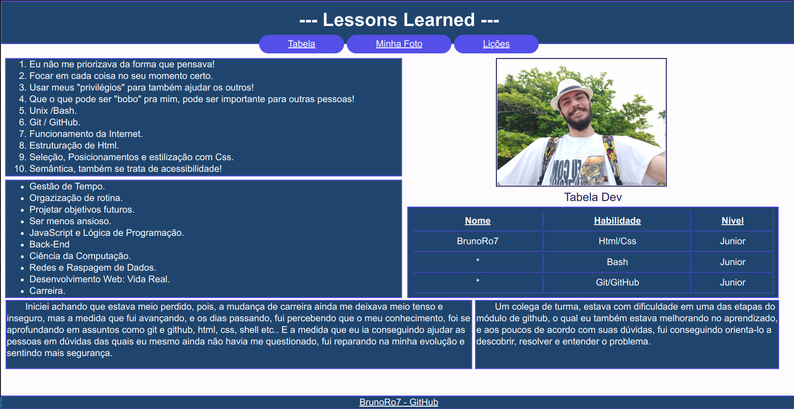

<div style="display:inline_block" align="center">

 # **Projeto Lessons Learned**
</div>

## **Contexto**:

Este projeto foi desenvolvido enquanto estudava na [Trybe](https://www.betrybe.com/) e foi realizado por _[Bruno Ro7](https://www.linkedin.com/in/brunoro7/)_.

Seu contexto principal foi utilizar HTML para construir uma página WEB. Utilizando HTML semântico para tornar a página mais acessível e melhor ranqueada de acordo com o _[CodeSniffer](https://squizlabs.github.io/HTML_CodeSniffer/)_. E utilizar CSS para adicionar estilo e posicionar os elementos.
Ele contêm uma série de informações sobre o que aprendi durante a parte de Fundamentos no curso da Trybe.

---

## **Técnologias usadas**

Front-end:
> Desenvolvido usando: **CSS3**, **HTML5**;

---

## **Instalação do projeto localmente:**
 
Para cada um dos passos, haverá um exemplo do comando a ser digitado para fazer o que está sendo pedido, caso tenha dificuldades e o exemplo não seja suficiente, sinta-se a vontade para me contatar em _[bruno.ro7c@gmail.com](bruno.ro7c@gmail.com)_.

1. Abra o terminal e crie um diretório no local de sua preferência com o comando **mkdir**:
```javascript
  mkdir projetos
```
> **obs**: lembrando que 'projetos' é o nome para o diretório, podendo ser qualquer outro nome;

2. Entre no diretório que acabou de criar e depois clone o projeto:
```javascript
  cd projetos
```

3. Faça o clone o projeto:
```javascript
  git clone git@github.com:brunoro7/lessons-Learned.git
```

> **Obs**: Para evitar problemas de CORS, utilize a extensão Live Server do VsCode para conseguir carregar todos os assets externos. Abra o arquivo index.html, clique em GoLiveServer localizado na barra inferior do seu VsCode, ou clicando com o o botão direito do seu mouse.

---

## **Escopo do Projeto**

Este projeto tem como base os seguintes requisitos:

- [x] 1. Precisa ter uma cor branca de fundo.
- [x] 2. Precisa ter uma barra superior com um título.
- [x] 3. Deve conter uma foto sua na página.
- [x] 4. Deve ter uma lista de lições aprendidas.
- [x] 5. Deve ter uma lista de lições que ainda deseja aprender.
- [x] 6. Precisa ter um rodapé.
- [x] 7. Deve ser inserido pelo menos um link externo na página.
- [x] 8. Deve ser criado um artigo sobre seu aprendizado.
- [x] 9. Deve ser criado uma seção que conta uma passagem sobre seu aprendizado.
- [x] 10. Os elementos HTML devem estar de acordo com o sentido e o propósito de cada um deles.

> #### **Bônus**
- [x] 11. Teste a semântica da sua página está aprovada pelo site CodeSniffer.
- [x] 12. Adicione uma tabela à página.
- [x] 13. Utilize o Box model.
- [x] 14. Altere atributos relacionados as fontes.
- [x] 15. Posicione o seu artigo e a seção sobre aprendizados um ao lado do outro.

<div  width="70vh" heigth="50vh" style="display:inline_block" align="center">

> ### **Demo**:

</div>
